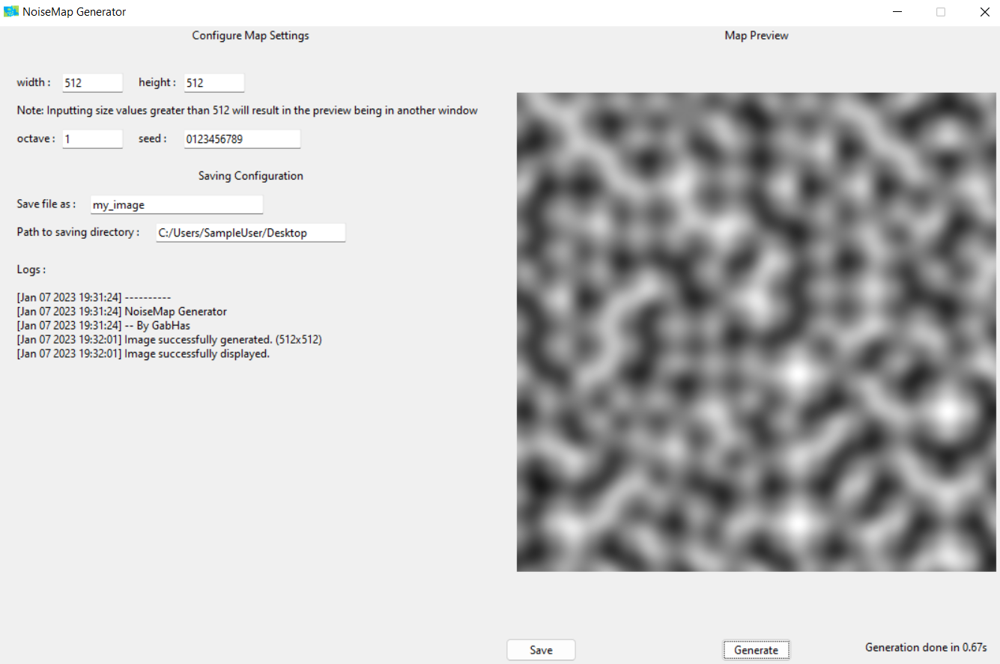
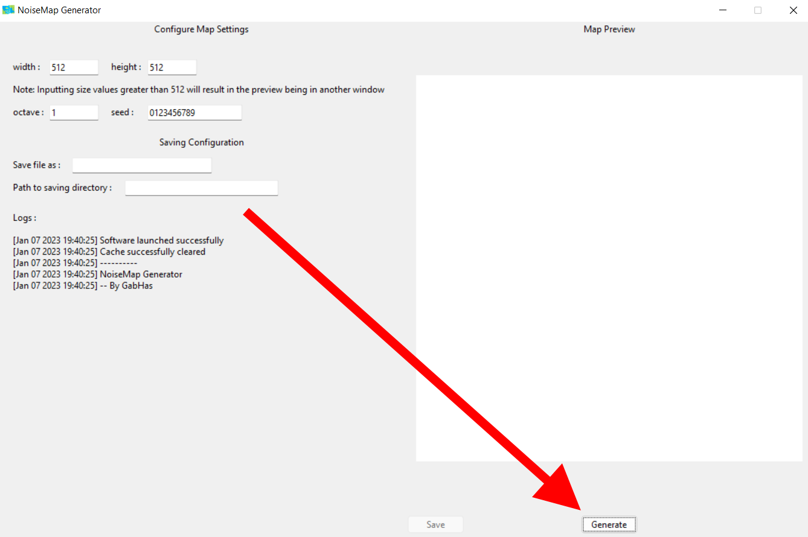
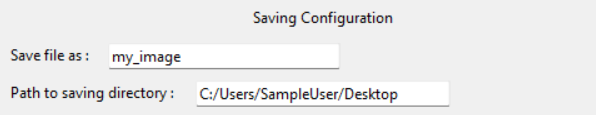

# NoiseMap Generator

## Description

NoiseMap Generator is a tool made to easily create noise images.
The noise algorythm used here is Perlin Noise combined with Fractional Brownian motion.



## Summary
- [Requirements](#requirements)
- [Project file](#project-file)
- [Features](#features)
- [Usage](#usage)
- [Credits](#credits)

### Requirements

To make this software run, the following packages are needed :
- [Python 3.8+](https://www.python.org/downloads/)
- [Pillow](https://python-pillow.org/)

To easily install all the requirements, you can perform the following command:
```shell
pip install -r requirements.txt
```

### Project file

Explanation of the project files :
- [app.py](app.py): The main script that contains the app code.
- `README.md`: What you are currently reading.
- [requirements.txt](requirements.txt): List of all the needed packages.
- [start.bat](start.bat): Small script to run the app.

The [asset](asset) folder:
- [asset/cache](asset/cache): All the file stored by the software. Cleared at all reboot.
- All the other: Needed resources to display the app and this file nicely.

The [lib](lib) folder:
- [noise.py](lib/noise.py): Perlin noise implementation used. See [original GitHub Page](https://github.com/TheRealGabHas/PerlinNoise)

The [logs](logs) folder:
- [session.txt](logs/session.txt): Contains the log of the current session.
- [all_time.txt](logs/all_time.txt): Contains the log of all the time you used the Software.


### Features

NoiseMap Generator contains the following features :
- Noise image generator and preview
- Image saving system
- Console logging system


### Usage

**Step 1:** Firstly, you must launch the app by executing [start.bat](start.bat).

**Step 2:** Select the parameters for the image that you want to generate :


Here are the parameters meaning:
- `width`: The image width (pixel).
- `height`: The image height (pixel).
- `octave`: Number of octaves to use in the generation.
- `seed`: The seed to use in the generation.

**Caution:** Inputting a greater value for `octave` will highly increase the amount of time the generation takes. 

**Step 3:** Click on the "Generate" button:


**Step 4:** If the image satisfies you, save it:


You must complete the fields:
- `Save image as :`: The name of the image.
- `Path to saving directory :`: The path to the folder where to save the image.


### Credits

This Software was made by GabHas:
- [GitHub](https://github.com/TheRealGabHas)
- [Website](https://gabhas.fr/)

Icon by Freepik - Flaticon:
- [Website](https://flaticon.com/)